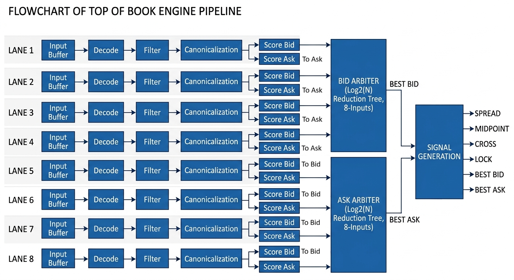
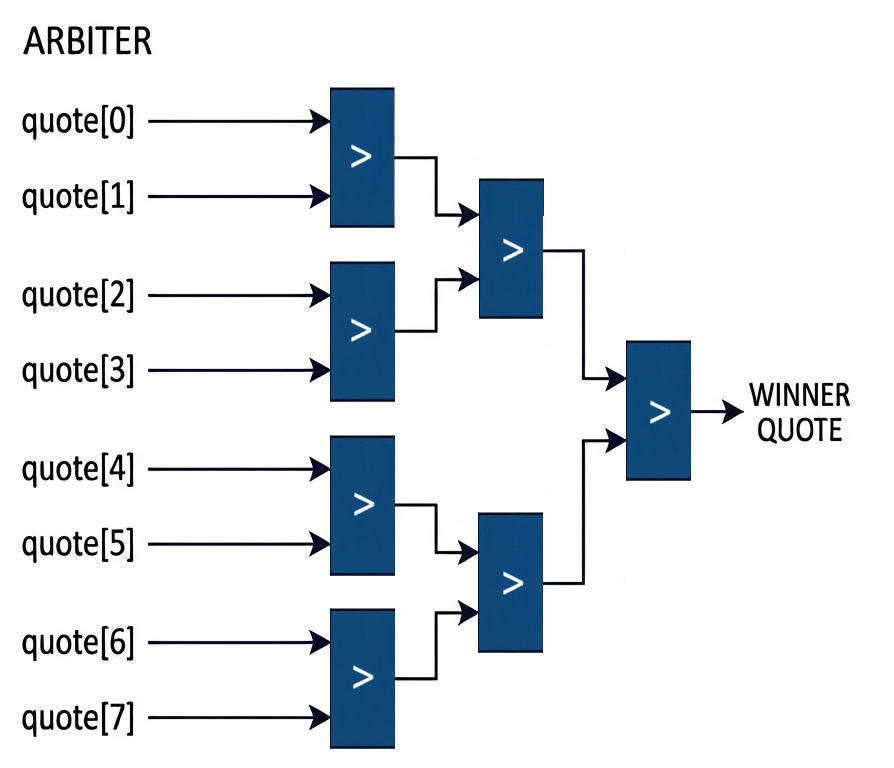

# FPGA Top-of-Book Engine
_Sub-40ns deterministic Top-of-Book arbitration engine._

Deterministic top-of-book engine processing 8 parallel lanes, selecting best bid/ask every cycle in **8 cycles** at **223.4 MHz**, with a **latency = 35.82 ns**.
- Throughput: 223.4 Mrps
- Latency: 8 cycles at 223.4 MHz
- Arbitration: O(log₂N) pipelined tournament tree

---

## System Overview

### Problem
A top-of-book engine continuously selects the highest bid and lowest ask from multiple incoming market data streams. This must be done in real time, as trading decisions depend on the most current market state. 

Latency is critical because even small delays can cause decisions to be made on stale data, reducing competitiveness. Additionally, incoming quotes may arrive out of order, so the system must enforce consistent ordering to prevent outdated updates from corrupting the current state.

### Design Goals
- Deterministic latency: The design produces outputs in a fixed number of cycles with no variation.
- Continuous throughput: The pipeline accepts and processes one quote per lane every cycle after fill.
- No backpressure or stalling: The design is fully streaming, avoiding buffering or flow control.
- Scalable parallelism: The architecture supports N (given N is a power of 2) input lanes, with arbitration scaling logarithmically.
- Comparator-friendly data representation: Data is transformed to allow a single, simple comparison logic for both bids and asks.
- Consistent state updates: Per-lane ordering is enforced to prevent stale or out-of-order data from affecting results.
- Latency-first design: Tradeoffs prioritize minimizing time latency over maximizing frequency.

### Architecture
The design processes quotes from 8 parallel input lanes, where each lane independently performs initial filtering and normalization. The data is then transformed into a unified format that allows direct comparison between bids and asks. A pipelined tournament tree selects the best bid and best ask across all lanes in logarithmic depth. Finally, the selected results are reconstructed and used to generate spread, midpoint, and market state signals.

---

## Pipeline Design

### Stage 1: Input Buffer
- Purpose: Align incoming data to the system clock
- Key operations: Registers incoming quotes per lane
- Why: Provides a stable starting point for the pipeline and ensures consistent timing across all lanes

### Stage 2: Decode
- Purpose: Extract structured fields from the raw input
- Key operations: Parses the bitstream into Valid, Side, Price, Timestamp and Size. Additionally, Lane ID is assigned by the module.
- Why: Converts raw input into a format that can be processed consistently in later stages

### Stage 3: Filter
- Purpose: Enforce increasing timestamps within each lane
- Key operations: Stores the last accepted timestamp and invalidates incoming quotes with older or equal timestamps
- Why: Prevents stale or out-of-order updates from corrupting the current state
- This is currently the critical path in the design.

### Stage 4: Canonicalization
- Purpose: Transform data into a common format for comparison
- Key operations: Inverts timestamps so that earlier updates are prioritized during comparison, and inverts prices for asks so that both bids and asks can be evaluated using the same comparator.
- Why: Allows a single comparator to select the best quote by always choosing the maximum value, regardless of side or timestamp ordering

### Stage 5: Scoring
- Purpose: Assemble comparison data for arbitration
- Key operations: Packs each quote into a score tuple (valid, price, timestamp, lane_id, size)
- Why: Enables deterministic selection of the best quote using lexicographic comparison, with lane_id acting as a final tie-breaker

---

## Arbitration Architecture

### Design
The best quote is selected using a pipelined tournament tree. Each level compares pairs of quotes and forwards the better one to the next stage, reducing N inputs to a single winner in log₂(N) steps. Pipelining the tree limits the amount of logic per stage, allowing higher operating frequency while maintaining continuous throughput.

### Score Representation
Each quote is represented as a tuple:
(valid, price, timestamp, lane_id, size)

Comparison is performed in this order. Valid ensures inactive quotes are ignored, price selects the best market value, timestamp preserves time ordering across lanes, and lane_id provides a deterministic tie-breaker. The size bits are ignored in the comparision.

### Comparator Design
Comparisons are implemented as lexicographic comparisons on the score tuple. The size field is excluded from the comparison to reduce logic depth and fan-in, improving timing. This allows the arbiter to focus only on fields that impact ordering while keeping the critical path short.

## Performance

### Final Metrics

| Metric        | Value        |
|--------------|-------------|
| Frequency     | 223.4 MHz     |
| Latency       | 8 cycles    |
| Time Latency  | 35.82 ns       |
| Throughput    | 223.4 Mrps     |
| Lanes         | 8        |

---

### Resource Utilization (Artix-7)
<!-- 
Show how much hardware the design uses.
Keep this simple and easy to read.
-->

| Resource | Usage | Utilization |
|----------|------|-------------|
| LUTs     | 2632 | 2%         |
| FFs      | 5324 | 2%         |
| BRAM     | 0    | 0%          |
| DSP      | 0    | 0%          |

LUT usage is dominated by comparator logic in the arbitration tree and datapath transformations. Flip-flop usage scales with pipeline depth and lane count, as each stage registers data per lane.

Resource usage grows approximately O(N log N) with the number of lanes due to the tournament tree structure.

---

### Critical Path

The critical path is located in the filter stage, specifically in the logic that evaluates whether an incoming quote should be accepted based on its timestamp. This path performs a timestamp comparison against the last accepted value and drives the clock enable of downstream registers.

The delay is dominated by the carry chain used for the timestamp comparison, combined with control logic for valid gating. This results in a multi-level combinational path that limits the maximum frequency.

This stage defines the overall timing limit of the design, with the final implementation meeting timing at 223.4 MHz with minimal slack.

---

### Optimization Highlights

- Pipelined arbitration tree: Pipelined the reduction tree, increasing Fmax from 85 MHz (8 cycles) to 182 MHz (10 cycles), significantly reducing overall latency.
- Datapath simplification: Reused spread computation for cross detection, reduced filter logic to invalidate only the valid bit, and removed non-critical fields from score comparision. This improved Fmax from 182 MHz to 223.4 MHz at constant latency.
- Pipelined filter: A pipelined filter stage increased Fmax to 240.8 MHz, but added one cycle of latency, resulting in a worse time-domain latency (45.68 ns vs 44.78 ns). This design was rejected in favor of lower absolute latency.
- Pipeline refinement: Removed unnecessary registers in decode and scoring stages, reducing total latency from 10 cycles to 8 cycles at constant frequency (223.4 MHz).

---

## Design Tradeoffs

- Latency vs frequency:
  The design prioritizes minimizing time-domain latency over maximizing frequency. For example, pipelining the filter stage increased Fmax (240.8 MHz) but added a cycle, resulting in worse absolute latency. This version was rejected in favor of the lower-latency 8-cycle design.
- Simplicity vs flexibility:
  The pipeline is fully streaming with no backpressure or buffering, simplifying control logic and ensuring deterministic behavior. This comes at the cost of flexibility, as the design cannot easily handle bursty inputs or variable-rate data without external buffering.
- Area vs speed:
  The design favors speed by using parallel lanes and a pipelined arbitration tree, increasing LUT and FF usage. Comparator logic and per-lane pipeline registers dominate resource usage. While area grows with the number of lanes, this tradeoff is acceptable for achieving low latency and high throughput.

## Repository Structure

The repository is organized to reflect the evolution of the design, with each branch capturing a key architectural milestone.
- `main`  
  Final optimized implementation (8 cycles @ 223.4 MHz). This branch contains the clean, production-ready RTL along with reports and documentation.
- `baseline_version`  
  Initial implementation with an unpipelined arbiter (85 MHz). Serves as a reference point for performance improvements.
- `pipelined_arbiter`
  
  Introduces the pipelined tournament tree, significantly improving frequency at the cost of additional latency.
- `datapath_optimization`  
  Focuses on datapath optimizations, including spread reuse, simplified filtering logic, and comparator width reduction.
- `filter_exp`  
  Experimental branch exploring a pipelined filter stage. Achieves higher frequency but worse time-domain latency, illustrating latency vs frequency tradeoffs.

## Future Work

- Support non power-of-2 lane counts: The current arbitration tree assumes a power-of-2 number of lanes. Extending the design to handle arbitrary lane counts would require padding strategies or an unbalanced tree structure.
- Filter stage restructuring: The filter stage is the current critical path due to timestamp comparison and control logic. Exploring alternative architectures, such as precomputed comparison signals or decoupling control from the data path, could improve timing without increasing latency.
- Physical-aware optimization: The current results are based on synthesis-level timing. Floorplanning, register duplication, and placement constraints could further improve Fmax and reduce routing delay.
- Interface integration: Integrating with realistic market data interfaces (e.g., packetized inputs or feed handlers) would expose system-level constraints such as input alignment, buffering, and clock domain crossings.
